# Pega Workshop - introduction to the exercises
Today, we’re diving into the powerful combination of Pega’s digital process automation platform and Red Hat OpenShift, the industry-leading enterprise Kubernetes platform. This session is designed to help you gain practical, real-world experience installing, configuring, and managing Pega workloads on OpenShift.

Throughout this workshop, we’ll explore key topics that will build your confidence in deploying and operating Pega in a containerized environment:

- **Navigating OpenShift** — Get comfortable with the OpenShift Web Console and CLI, exploring how resources are organized and managed across projects.
 
- **Deploying Workloads** — Learn multiple deployment methods including Helm charts, Operators, and direct YAML/oc deployments.

- **Deployment Strategies** — Understand how to design resilient, scalable Pega environments using rolling, blue-green, and canary strategies.

- **Networking Deep Dive** — Examine OpenShift’s networking model, routes, and service exposure options to ensure Pega is reachable and secure.

- **Troubleshooting & Best Practices** — Use built-in tools and logs to diagnose and resolve common issues in Pega deployments.

By the end of the workshop, you’ll have hands-on experience deploying Pega on OpenShift, understanding not just how to make it work—but why OpenShift is the ideal foundation for modernizing and scaling your Pega applications.

Let’s get started and see what’s possible when Pega meets OpenShift!

# Exercise 1 - Prepare Pega install
To deploy Pega, we need to prepare the environment to install and run the workload. The first step is to create a project where we can deploy our Pega containers and its dependencies.

```
oc new-project pega
```

The Pega installer pod is very large and requires a machine large enough to schedule it. Using the ROSA CLI create a new MachinePool of the larger instance type

Find the cluster name printed in the output
```bash
rosa cluster list
```
Create a machinepool with a 4xlarge instance type using the cluster name above
```bash
rosa create machinepool --cluster=${CLUSTER_NAME} --name=big --replicas=1 --instance-type=m6a.4xlarge
```

# Explain: Dev Console walkthrough
The Developer Perspective in OpenShift is designed to give application developers a streamlined, visual way to build, deploy, and manage workloads — without needing to dive deep into cluster administration. It focuses on application delivery, developer productivity, and rapid iteration.

To switch to the developer perspective use the left hand navigation pane:
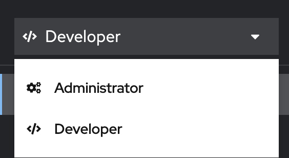

#### 1. Topology View — The Big Picture
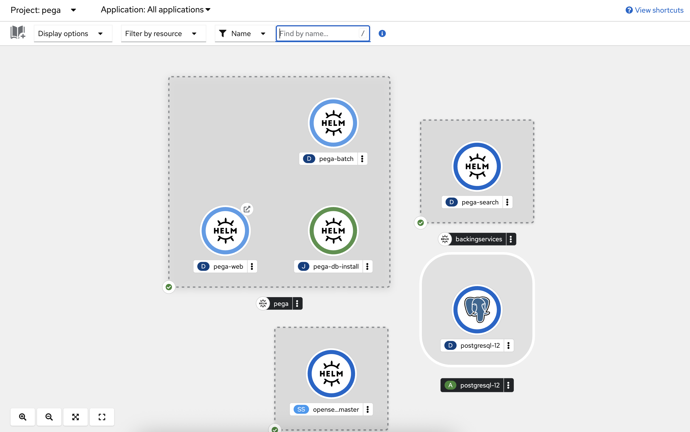

 The Topology view gives you a visual map of all your applications and components running in a project (namespace). You can see deployments, services, routes, and how they connect — all in real-time. It’s great for understanding relationships between microservices or quickly spotting unhealthy pods.

#### 2. Add Menu — Multiple Deployment Options
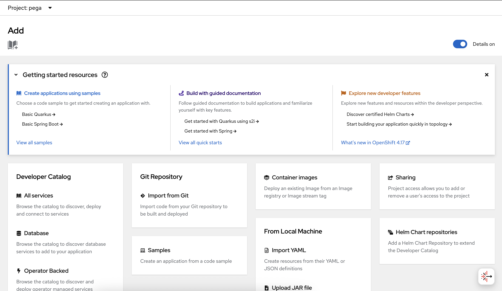
The “+Add” page is your launchpad for creating new workloads. You can deploy apps using:
- Git Repository (build and deploy directly from source)
- Container Image (deploy pre-built images)
- Helm Charts (template-based deployments)
- Operator Backed Services (deploy via certified operators)

View of the Helm integration in the developer perspective

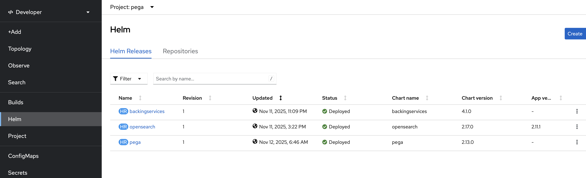

#### 3. Build & Pipelines

Integration with Tekton Pipelines means you can automate build-test-deploy workflows seamlessly.

#### 4. Networking Made Easy

Quickly view and manage Routes, Services, and Ingress directly from the UI.

#### 5. Monitoring & Troubleshooting

Get direct access to pod logs, events, and metrics without switching to the Administrator Perspective. Drill down into pods or components to identify issues fast — great for day-to-day debugging.

The Developer Perspective is all about speed and self-service — empowering developers to:
- Deploy faster, without waiting for ops teams.
- Visualize applications and dependencies instantly.
- Integrate modern CI/CD and GitOps workflows.
- Stay focused on building, not managing infrastructure.

# Explain: Deploying and Managing applications

OpenShift provides multiple ways to create and manage workloads — giving developers and operators flexibility depending on their skill level, deployment complexity, and automation needs. Let’s look at the main approaches you can use.

## Templates — Parameterized, Reusable Blueprints

### What they are:
OpenShift Templates are predefined sets of Kubernetes objects (like Deployments, Services, Routes, ConfigMaps, etc.) packaged together with parameters that can be customized at deployment time.

### Why they’re useful:
- Great for standardized, repeatable deployments — e.g., quickly spinning up dev environments or demo apps. You can use parameters to customize image versions, replicas, or resource limits.
- Templates are easy to store in Git and apply via the CLI or web console
## Operators — Declarative, Lifecycle-Aware Automation

### What they are:
Operators extend Kubernetes by embedding domain-specific operational knowledge into the cluster. They use Custom Resource Definitions (CRDs) to automate not just deployment, but day-2 operations — upgrades, backups, scaling, configuration, etc.

### Why they’re powerful:

- Provide full lifecycle management of complex applications (like Pega, databases, Kafka, etc.).

- Reduce human error through automation and consistent configuration.

- Delivered and managed through the OperatorHub in OpenShift.

## Helm Charts — Kubernetes Package Manager

### What they are:
Helm is the package manager for Kubernetes, allowing you to deploy and manage applications as versioned “charts.” A chart bundles all Kubernetes manifests plus configuration values into a single deployable unit.

### Why they’re convenient:

- Simplifies deployment of complex applications with multiple components.

- Allows parameter customization via values.yaml or CLI overrides.

- Easily integrates into CI/CD and GitOps workflows.

# Exercise 2: Deploy components required by Pega
Pega has a dependency on various external services in order to run. These services (Kafka, Postges, OpenSearch) can also be deployed on OpenShift in containers using the various methods described above.

## Deploy OpenSearch using Helm charts
1) Assign required privileges for the service account
```bash
oc adm policy add-scc-to-user privileged -z default
```
2) Create storage for OpenSearch using the yaml in this repo. Inspect the opensearch.yaml file to view its contents.

```
oc apply -f opensearch.yaml
```
3) Using Helm charts, we will deploy OpenSearch
```bash
helm repo add opensearch https://opensearch-project.github.io/helm-charts/

helm install opensearch opensearch/opensearch --version 2.17.0 --namespace pega

oc scale statefulset opensearch-cluster-master --replicas=0
```
4) We need to set environment variables for the OpenSearch Stateful Set. We will explain more of the differences between StatefulSets, Deployments, and other mechanisms for managing Kubernetes applications in the next section.
   
```bash
# Add a password and disable SSL
oc set env statefulset/opensearch-cluster-master OPENSEARCH_INITIAL_ADMIN_PASSWORD=Openshift123!
oc set env statefulset/opensearch-cluster-master plugins.security.disabled=true
oc set env statefulset/opensearch-cluster-master plugins.security.ssl.http.enabled=false

# Scale pods down before adding environment variables
oc scale statefulset opensearch-cluster-master --replicas=3
```
## Deploy Postgres using YAML
The Pega application requires a database to install its rule schema. For this workshop we will use a Postgres Database. Create the database using the file provided in this repo:
```bash
oc apply -f postgres-12.yaml
```

## Deploy Kafka using a Operator
Pega requires a Kafka broker to be set up. For this lab we will install the Red Hat distribution of Kafka, AMQ Streams. To deploy AMQ Streams, we will use the OpenShift Operator catalog to find, configure and deploy our Kafka instance.

1) from the OpenShift Console, navigate to the Operator catalog using the left hand navigation
   
   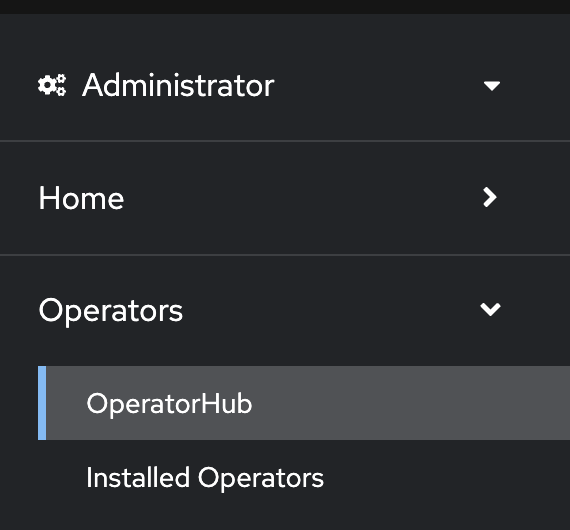
2) Find the AMQ Streams Operator in the catalog
   
   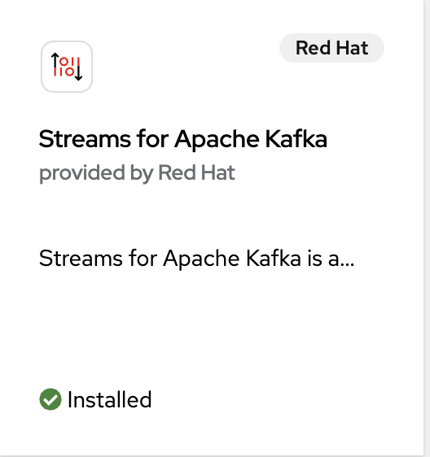
3) Once the operator deploys you should have options to create different resources. Click the "kafka" resource
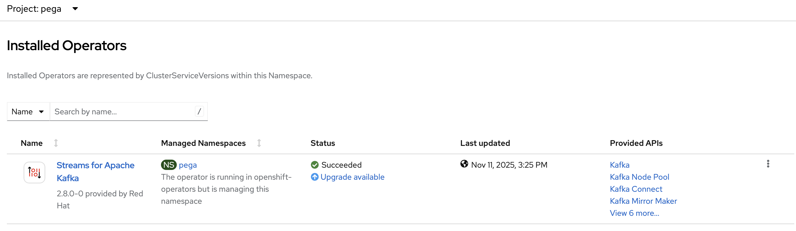

1) Create a kafka resource named ***pega-kafka-cluster***. Leave all of the defaults and click Create to proceed.
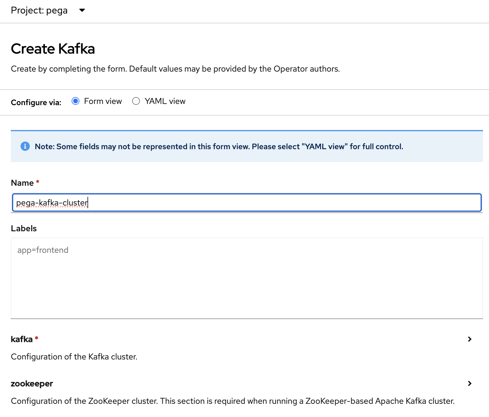

1) The Kafka broker will be running when the status of the object shows READY:

# Explain: Different types of workloads

Kubernetes (and by extension, OpenShift) provides several built-in controllers to manage how workloads are deployed, scaled, and maintained across a cluster. Each type serves a different purpose depending on the application’s behavior and lifecycle:

**Deployments** are the most common way to run stateless applications such as web front ends or APIs. They handle scaling, rolling updates, and automatic recovery if pods fail — making them ideal for most microservices.

**StatefulSets** are used for stateful applications that need stable network identities or persistent storage, like databases or message queues. They ensure pods start in a specific order and keep their storage consistent across restarts.

**DaemonSets** ensure that a copy of a pod runs on every node (or a selected subset of nodes). They’re perfect for cluster-wide services such as log collectors, monitoring agents, or networking tools that need to run everywhere.

**Jobs (and CronJobs)** are designed for short-lived or scheduled tasks — like running a data import, batch process, or nightly cleanup. They run pods until completion rather than continuously.

Together, these controllers give OpenShift the flexibility to manage everything from always-on production workloads to on-demand compute jobs — ensuring that every type of application runs efficiently and reliably in the cluster.

    * Deployment - use one of the deployments and talk about it - ChatGPT - generate a 2 sentence explanation highlighting Deployments in OpenShift
    * Stateful Set/Daemon set - OpenSearch is a stateful set, highlight when and why they are used 
        * ChatGPT - provide an explanation of statefulsets and deamonsets. Explain when they are used and provide examples.
    * Jobs - the Pega batch process that spins up and creates the database. When it finishes it terminates ChatGPT - explain Kubernetes jobs and provide an example use case.
# Exercise 3 - Deploy Pega backingservices via Helm chart
1) Add the PEGA Helm repo:
```bash
helm repo add pega https://pegasystems.github.io/pega-helm-charts
```
2) Modify the values in the backingservices.yaml file within this repo as follows reference:
```bash
k8sProvider: <SET TO 'openshift'>
deploymentName: <SET TO THE DESIRED NAME FOR THE OPENSHIFT DEPLOYMENT>
srs.srsRuntime.srsImage: <REPLACE WITH THE LOCATION OF YOUR `pega-docker.downloads.pega.com/platform-services/search-n-reporting-service-os` IMAGE PREVIOUSLY LOADED TO THE INTERNAL REGISTRY>
srs.srsStorage.provisionInternalESCluster: <SET TO 'false' TO USE THE PREVIOUSLY DEPLOYED OPENSEARCH CLUSTER>
srs.srsStorage.domain: <SET TO THE OPENSEARCH SERVICE ADDRESS>
srs.srsStorage.port: <SET THIS TO THE OPENSEARCH SERVICE PORT>
srs.srsStorage.protocol: <SET TO 'http' SINCE SSL SHOULD BE DISABLED>
srs.srsStorage.tls.enabled: <SET TO 'false'>
srs.srsStorage.authCredentials.username: <SET TO 'admin'>
srs.srsStorage.authCredentials.password: <SET TO 'Openshift123!'>
```
3) Run the Helm chart for the backingservices using the following command:
```
helm install backingservices pega/backingservices --namespace pega --values backingservices.yaml 
```
4) You will see the Pega search pods failing to deploy. In the next section we will provide some tools to troubleshoot common issues with workloads on OpenShift

# Explain: Troubleshooting
When something goes wrong in OpenShift — a pod crash, a failed deployment, or unexpected app behavior — the platform offers several built-in tools to help you quickly identify and resolve issues. OpenShift integrates Kubernetes’ native observability features with additional developer-friendly interfaces, making troubleshooting faster and more visual.

🔍 Key Troubleshooting Tools and Techniques
### 1. Pod Logs

Logs are the first place to look when diagnosing application issues.

Through the Web Console or oc logs command, you can view container output in real time or historical logs from previous pod instances.

Useful for detecting application-level errors, failed startups, or exceptions during runtime.
```
oc logs <pod-name>
```
### 2. Web Terminals & Remote Shell Access

The OpenShift Web Terminal (and oc rsh) lets you open a remote shell inside a running container.

This is ideal for live debugging — checking configuration files, connectivity, or environment variables directly inside the pod.
```
oc rsh <pod-name>
```
### 3. Events

Kubernetes events provide insight into what’s happening inside the cluster — such as scheduling delays, image pull errors, or failed probes.

You can view them per resource in the Web Console or use:
```
oc get events --sort-by=.metadata.creationTimestamp
```

Events often reveal infrastructure or scheduling issues that logs may not show.

### 4. Pod & Deployment Status

Each workload has a detailed status view in the OpenShift console that shows current pod states, restart counts, and readiness conditions.

The CLI equivalent ```(oc describe pod <name>)``` provides a complete resource breakdown including events, image details, and probe results.

### 5. Monitoring & Metrics

OpenShift integrates with Prometheus and Grafana to collect and visualize metrics like CPU, memory, and network usage.

These dashboards help identify performance bottlenecks or resource limits causing restarts or throttling.

### 6. Topology & Visual Debugging

The Developer Perspective Topology View offers a visual map of all workloads, showing health indicators, connection lines, and quick links to logs and terminals.

It’s a fast, intuitive way to spot issues across microservices at a glance.

    * console logs - switch to a pod and look at the logs for errors
    *  dev terminal - open up a terminal to a pod via the CLI or the oc command from the bastion
    *  events - look at the different types of events and talk about what is happening here
    * Other troubleshooting tools to talk about - oc rsh, debug pods, ssh into coreos host, 

# Exercise 4 - Troubleshoot failed backingservice deployment
1) Navigate to the Pod logs for the Pega Search pod. Navigate to the logs tab. You will see a failure on connecting to the opensearch database
2) This failure is due to a NetworkPolicy blocking communication to the OpenSearch service. NetworkPolicies act as a firewall between OpenShift projects and namespaces. We need to remove this to allow communication to the OpenSearch service
```bash
oc patch networkpolicy/pega-search-networkpolicy --type=json -p '[{"op": "add", "path": "/spec/egress/0/to/0/podSelector/matchLabels", "value": {app.kubernetes.io/name: "opensearch"}}]'
```   

# Exercise 5 - Deploy Pega web via Helm chart
1) Modify the values in the pega.yaml file within this repo as follows reference:
```bash
provider: <SET TO 'openshift'>
jdbc.url: <SET TO 'jdbc:postgresql://postgresql-12.pega.svc.cluster.local:5432/postgres'>
jdbc.driverClass: <SET TO 'org.postgresql.Driver'>
jdbc.dbType: <SET TO 'postgres'>
jdbc.driverUri: <SET TO 'https://jdbc.postgresql.org/download/postgresql-42.7.5.jar'>
jdbc.username: <SET TO 'postgres'>
jdbc.password: <SET TO 'postgres'>
jdbc.rulesSchema: <SET TO 'rules'> 
jdbc.dataSchema: <SET TO 'data'>
docker.pega.image: <REPLACE WITH THE LOCATION OF YOUR `pega-docker.downloads.pega.com/platform/pega` IMAGE PREVIOUSLY LOADED TO THE INTERNAL REGISTRY>
tier.ingress.domain: <SET TO THE OPENSHIFT ROUTE FOR PEGA WEB USING THE FOLLOWING FORMAT: '<app_name>-<namespace>.apps.<FQDN>'. e.g. 'pega-pega.apps.aromero.z72i.p1.openshiftusgov.com'>
cassandra.enabled: <SET TO 'false'>
cassandra.persistence.enabled: <SET TO 'false'>
pegasearch.externalSearchService: <SET TO 'true'>
pegasearch.externalURL: <SET TO 'http://opensearch-cluster-master.pega.svc.cluster.local:9200' WHICH IS THE SERVICE POINTING TO OPENSEARCH>
installer.image: <REPLACE WITH THE LOCATION OF YOUR `pega-docker.downloads.pega.com/platform/installer` IMAGE PREVIOUSLY LOADED TO THE INTERNAL REGISTRY>
installer.upgrade.pegaRESTUsername: <SET TO 'pega'>
installer.upgrade.pegaRESTPassword: <SET TO 'pega'>
hazelcast.enabled: <SET TO 'false'>
stream.bootstrapServer: <SET TO 'pega-kafka-cluster-kafka-bootstrap.pega.svc.cluster.local:9092' WHICH IS THE SERVICE FOR THE KAFKA BROKERS>
```
2) Run the Helm Chart for the database schema creation and PEGA Web deployment using the following command:
```
helm install pega pega/pega --namespace pega --values pega.yaml --set global.actions.execute=install-deploy
```
3) Navigate to the installer pod and view its logs. After a moment you should see installer pod begin creating the Pega database.
   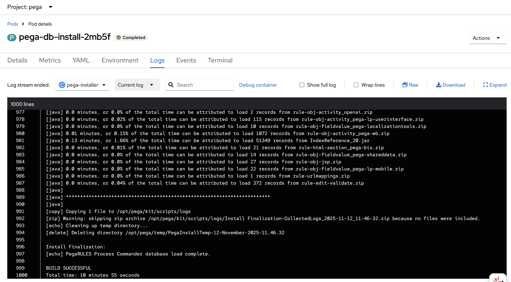

NOTE: The database install process takes about 20 minutes to complete, followed by the PEGA Web deployment


# Explain: Networking

Networking in OpenShift is built on top of Kubernetes’ powerful networking model — designed to make communication between applications, services, and users consistent, secure, and automated. Every component in OpenShift — from pods to services to routes — plays a role in how traffic flows within and outside the cluster. Understanding these building blocks is essential for deploying and exposing applications effectively.

### 1. Services — Stable Access to Pods

In Kubernetes and OpenShift, Services act as stable, internal endpoints that group a set of pods together and expose them on a consistent network address.

They load balance traffic across pod replicas, even as pods are added or replaced.

Services use labels and selectors to automatically track which pods belong to them.

There are several types, such as:

- **ClusterIP**: Default, internal-only access within the cluster.
- **NodePort**: Exposes an application on each node’s IP at a static port.
- **LoadBalancer**: Integrates with external load balancers (in cloud environments).

Think of a Service as the internal “phone book entry” for your pods — always reachable, even when the pods change.

### 2. Routes — External Access Made Simple

Routes are an OpenShift-specific resource that extends Kubernetes networking to make applications accessible from outside the cluster.

- They define hostname-based HTTP(S) endpoints for applications.

- Routes integrate with OpenShift’s built-in HAProxy router for TLS termination, edge routing, and path-based routing.

- You can easily secure a Route using custom or OpenShift-managed certificates.

Routes make it easy to say: “Expose my service to the world at myapp.apps.cluster.example.com.”

### 3. Ingress — Kubernetes Standard for External Traffic

Ingress is the upstream Kubernetes equivalent of Routes.

It uses Ingress Controllers (like OpenShift’s router) to manage HTTP(S) traffic rules and routing for multiple services.

While OpenShift traditionally favors Routes, it fully supports Ingress resources for compatibility and standardization.

Ingress gives you fine-grained control of how requests from outside the cluster reach services inside it.

### 4. Network Policies — Controlling Traffic Flow

By default, all pods in a project can communicate with each other. Network Policies provide a way to define fine-grained rules that restrict which pods or namespaces can talk to one another.

They’re used to isolate workloads, enforce zero-trust network models, and meet security compliance requirements.

Policies are based on pod labels, namespaces, and ports.

Think of Network Policies as firewall rules for your cluster — defining “who can talk to whom.”

# Exercise 6 - Accessing the Pega UI

Once the PEGA Web pod comes online, you can access the PEGA Web container using the route specified in the pega.yaml Helm configuration file (tier.ingress.domain):

1) Browse to routes under networking on the left hand navigation pane.
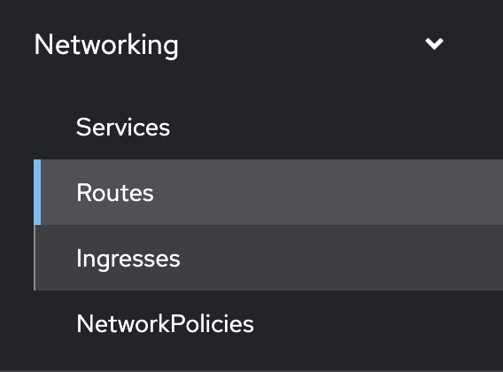

2) Find the Pega route that was created and click the URL
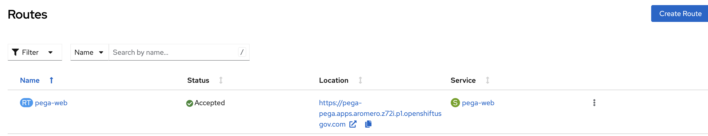  

On initial login, must use the following credentials:
```
username: administrator@pega.com
password: ADMIN_PASSWORD
```
NOTE: You will be asked to replace your password upon first login.

### Putting It All Together

In OpenShift:

- Pods run your app containers.

- Services provide stable internal communication.

- Routes or Ingress expose applications to the outside world.

- Network Policies secure and isolate network traffic.

Together, these components make OpenShift networking both flexible and secure, enabling seamless communication for everything from internal microservices to public-facing enterprise applications.
   
    * Services - Talk about service connections. A good place to talk about this is when the Pega Database is being created. Highlight how the Pega pod connects to the database via the service URL
    * Routes - explain what they are and access the Pega console via the OpenShift Route and end the workshop here

# Wrap up
You’ve just taken a full tour through what it means to run Pega on OpenShift, from installation all the way through deployment, scaling, and troubleshooting.

We explored the OpenShift console and CLI, deployed Pega using Helm, Operators, and manifests, experimented with different deployment strategies, and even dug into networking and debugging to see how everything connects under the hood.

What you did today is what real-world cloud engineering looks like — hands-on, problem-solving, and iterative.

If there’s one takeaway, it’s this: OpenShift gives you the power and flexibility to run enterprise apps like Pega the right way — consistently, securely, and at scale.

Thank you all for the energy, questions, and collaboration today. Keep experimenting, keep breaking things safely, and keep building awesome solutions on OpenShift!